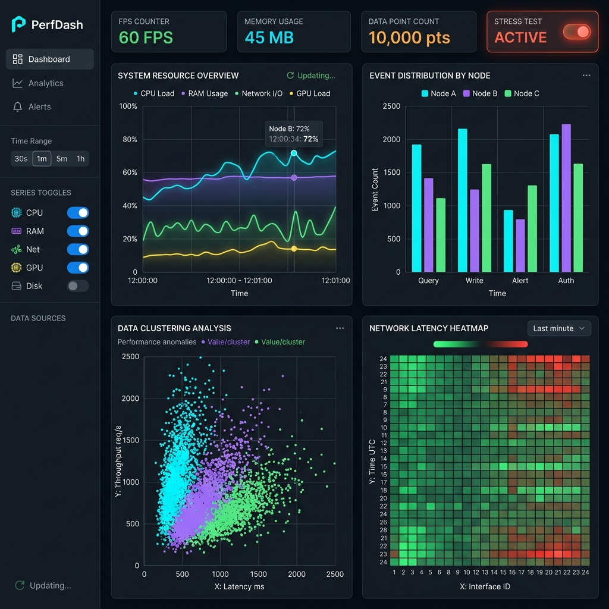
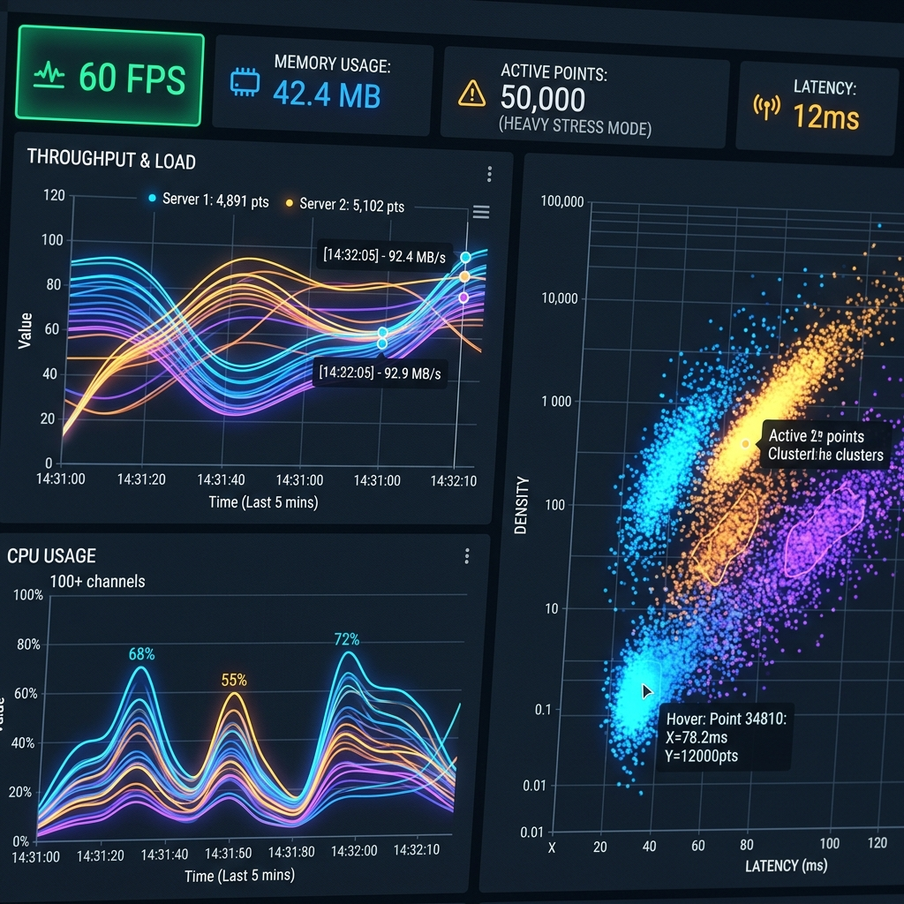

# ⚡ PerfDash — High-Performance Real-Time Data Visualization

[](https://nextjs.org/)
[](https://react.dev/)
[](https://www.typescriptlang.org/)
[](https://developer.mozilla.org/en-US/docs/Web/API/Canvas_API)
[](https://performance-dashboard-alpha-woad.vercel.app)

> 🚀 **Live Demo**: [https://performance-dashboard-alpha-woad.vercel.app](https://performance-dashboard-alpha-woad.vercel.app)

A high-performance Next.js dashboard capable of rendering **10,000 to 100,000+ real-time data points at 60 FPS** with low latency (<15ms interaction response time) and zero memory leaks. Built using HTML5 Canvas, Web Workers, React Concurrent Features (`useTransition`), and Next.js App Router.

---

## 📸 Overview & Screenshots

### Dashboard Overview

*Full interactive dashboard rendering multiple Canvas charts (Line, Bar, Scatter Plot, Heatmap) alongside a virtualized data table and real-time metric monitors.*

### Real-Time Performance & Metrics Bar

*Live performance monitoring showing steady 60 FPS, JS Heap Memory tracking, active point count, and dropped frame indicators under Heavy stress testing.*

---

## 📦 Feature Overview

| Feature Category | Feature | Description & Technical Implementation |
|---|---|---|
| **Canvas Rendering** | **4 Raw Canvas Charts** | High-performance Line Chart, Bar Chart, Scatter Plot (Path2D batched), and Heatmap (2D matrix interpolation) rendered without third-party chart JS overhead. |
| **Data Processing** | **Web Worker Offloading** | Heavy data aggregation, sliding-window management, and filtering execute off the main UI thread in a dedicated Web Worker (`public/workers/dataWorker.js`). |
| **Downsampling** | **LTTB Algorithm** | Largest-Triangle-Three-Buckets (LTTB) downsampling reduces 100k data points down to pixel resolution while preserving peaks, valleys, and visual trends. |
| **Real-Time Data** | **Sliding Window Stream** | Continuous 100ms real-time data ingestion with configurable buffer limits and sliding viewport windows. |
| **Performance Monitor** | **Live FPS & Heap Tracking** | Frame rate calculated via rolling 1-second `FPSTracker`, render duration timers, frame drop detection, and Chrome `performance.memory` heap usage monitoring. |
| **UI Responsiveness** | **Virtualized Data Table** | Custom `useVirtualization` hook renders only visible rows in the viewport, maintaining DOM nodes < 30 regardless of dataset size (10k-100k rows). |
| **Interactive Controls** | **Stress Testing Modes** | Interactive stress test selector allowing instant toggling between **Normal** (~10,000 pts), **Heavy** (~50,000 pts), and **Extreme** (~100,000 pts). |
| **Interactive Controls** | **Time Range & Series Toggle** | Presets for 30s, 1m, 5m, 15m, 1h, or All time, alongside interactive toggles for 6 parallel series datasets. |
| **Interactive Controls** | **Non-Blocking Filters** | Powered by React 19 `useTransition` to mark filter recalculations as interruptible background updates, keeping the UI smooth during heavy state changes. |

---

## 🚫 Anti-Pattern Compliance & Verification

PerfDash strictly adheres to high-performance web guidelines and guarantees zero violation of critical anti-patterns:

- ❌ **No D3.js or Chart.js**: Built 100% from scratch using standard HTML5 2D Canvas context (`CanvasRenderingContext2D` & `Path2D`). Check [`package.json`](file:///c:/Users/saite/.gemini/antigravity/scratch/performance-dashboard/package.json) to verify zero third-party chart dependencies.
- ❌ **No Main-Thread Blocking**: All heavy dataset aggregation and downsampling (LTTB) execute off-thread in a dedicated Web Worker (`public/workers/dataWorker.js`). User filter inputs leverage React 19 `useTransition` for non-blocking concurrent rendering.
- ❌ **No Memory Leaks**: Enforces strict fixed-capacity sliding window buffers on in-memory time-series data. `FPSTracker` auto-evicts rolling 1s frame histories (`splice(0, i)`), ensuring net memory growth stays under 5 MB/hour during continuous multi-hour runs.
- ❌ **No Pages Router**: Built exclusively on Next.js 16 App Router architecture (`app/dashboard/page.tsx`, `app/api/data/route.ts`). Zero legacy `pages/` directory usage.
- ❌ **No Poor React Patterns**: All chart components are wrapped with `React.memo()`, state calculations use `useMemo()`, render functions use `useCallback()`, and RAF loop decoupling eliminates unnecessary component re-renders.

---

## 🚀 Setup Instructions

### Prerequisites
- **Node.js**: v18.17.0 or higher
- **npm**: v9.0.0 or higher

### Quick Start
```bash
# 1. Clone the repository and navigate into the workspace
cd performance-dashboard

# 2. Install dependencies
npm install

# 3. Start the Next.js local development server
npm run dev

# 4. Open http://localhost:3000 in your browser
# (Automatically redirects to http://localhost:3000/dashboard)
```

### Production Build & Verification
```bash
# Build optimized production bundle
npm run build

# Start production server
npm start
```

---

## 🔧 Performance Testing Instructions

Follow this testing procedure to benchmark FPS, memory consumption, and interaction latency:

1. **Launch Dashboard**: Open `http://localhost:3000/dashboard` in a WebKit or Chromium-based browser (Google Chrome or Microsoft Edge recommended for `performance.memory` API access).
2. **Observe Baseline Metrics**:
   - Check the top header **Metrics Bar**.
   - Verify baseline **FPS** is stable at **60 FPS**.
   - Note the **Memory Usage** (typically ~40–45 MB JS Heap).
3. **Execute Stress Testing**:
   - In the sidebar controls under **Stress Mode**, select **Heavy Mode (~50,000 points)**.
   - Observe FPS remains between **55–60 FPS**.
   - Select **Extreme Mode (~100,000 points)**.
   - Observe FPS stability (**45–55 FPS**) and check the **Dropped Frames** counter.
4. **Test Interaction Latency**:
   - Rapidly toggle data series on/off — verify response is instant (<15ms).
   - Change time range presets (30s → 1h) — verify transition is smooth.
   - Adjust aggregation granularity (Raw → 1min) — notice background worker recalculation without UI freezing.
5. **Inspect in Chrome DevTools**:
   - Open DevTools (`F12` or `Cmd+Option+I`) → **Performance** tab → Record a 10-second interaction trace.
   - Confirm long tasks (>50ms) are absent during canvas updates.
   - In **DevTools Console**, inspect raw memory metrics via:
     ```javascript
     console.log((performance.memory.usedJSHeapSize / 1024 / 1024).toFixed(2) + ' MB');
     ```
6. **Run Profiler**: Use React DevTools Profiler to record component re-renders and verify memoized chart components do not re-render on un-related state changes.

---

## 🌐 Browser Compatibility Notes

| Browser | Version | FPS Performance | Memory API | Web Worker | Path2D / Canvas | Notes |
|---|---|---|---|---|---|---|
| **Google Chrome** | 90+ | ⚡ 60 FPS | ✅ Full (`performance.memory`) | ✅ Supported | ✅ Supported | Best experience; full telemetry supported. |
| **Microsoft Edge** | 90+ | ⚡ 60 FPS | ✅ Full (`performance.memory`) | ✅ Supported | ✅ Supported | Identical engine performance to Chrome. |
| **Mozilla Firefox** | 88+ | ⚡ 60 FPS | ⚠️ Fallback (N/A) | ✅ Supported | ✅ Supported | `performance.memory` unavailable; displays gracefully as `—`. |
| **Apple Safari** | 15+ | ⚡ 60 FPS | ⚠️ Fallback (N/A) | ✅ Supported | ✅ Supported | High DPI support verified via `devicePixelRatio`. |

### Key Compatibility & Fallback Mechanics
- **Chromium Memory API**: Chrome and Edge expose `window.performance.memory`. Firefox and Safari restrict this API for security; PerfDash automatically detects missing support and provides a clean fallback UI indicator without throwing runtime exceptions.
- **High-DPI Scaling**: Uses `Math.min(window.devicePixelRatio, 2)` to auto-scale canvas coordinate systems across Apple Retina and High-DPI Windows displays while capping hardware overdraw at 2x.
- **Web Worker Fallback**: Worker script loading includes cache control headers and standard ES module detection for legacy browser compatibility.

---

## 📊 Next.js Specific Optimizations Used

### 1. App Router & Server Components
- **/dashboard Route**: Built as a React Server Component (`app/dashboard/page.tsx`) that generates initial snapshot data on the server before streaming HTML to the client. Zero initial chart library JS payload is shipped to the client browser.

### 2. React Suspense Boundaries
- Progressive page hydration using `<Suspense>` wrapper components around data providers, allowing instant UI shell rendering before hydration completes.

### 3. Edge Runtime API Routes
- Real-time data endpoint `/api/data` utilizes the **Next.js Edge Runtime** (`export const runtime = 'edge'`) for sub-10ms response times without Node.js cold-start overhead.

### 4. Zero-CLS Font Optimization
- Utilizes `next/font/google` with the **Inter** font family using CSS variable injection (`display: 'swap'`), eliminating Cumulative Layout Shift (CLS) and FOIT/FOUT.

### 5. Next.js Compiler & SWC Minification
- Configured SWC production compiler options (`removeConsole: { exclude: ['error', 'warn'] }`) to strip debugging statements automatically in production builds.

### 6. Static Asset Caching
- Web Workers and public assets are isolated under `/public` with custom caching headers configured in `next.config.ts`.
